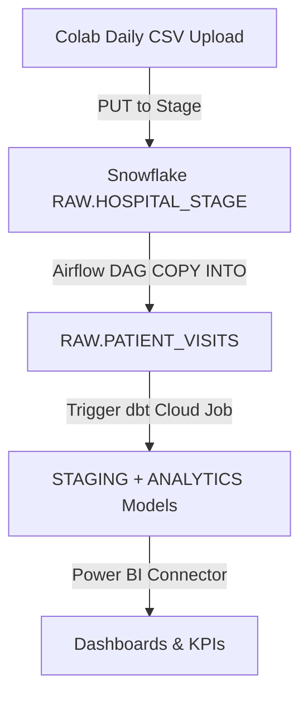

# 🏥 Hospital Readmission Analytics Pipeline (Astronomer Orchestration)  

## 📌 Overview  
This repository contains the **Airflow orchestration layer** of the Hospital Readmission Analytics pipeline, deployed on **Astronomer**.  

The DAGs here automate ingestion of hospital encounter data (simulated with Colab uploads to Snowflake), log audits, and trigger downstream dbt transformations.  

👉 Note: The dbt models (`staging`, `fact_visits`, `dim_patients`, etc.) are stored in a **separate repo** dedicated to data modeling.  

---

## ⚙️ Tech Stack  
- **Data Source**: Kaggle Diabetes Hospital Readmission dataset  
- **Warehouse**: Snowflake (`RAW`, `STAGING`, `ANALYTICS`)  
- **Orchestration**: Apache Airflow on Astronomer  
- **Data Simulation**: Google Colab (daily chunk upload → Snowflake Stage)  
- **Transformations**: dbt Core (in a separate repo)  
- **Docs & Versioning**: GitHub  

---

## 🚀 Pipeline Flow  



---

## 📂 Repository Structure  

```
.
├── .astro/                # Astronomer config
│   └── config.yaml
├── dags/                  # Airflow DAGs
│   ├── daily_stage_loader.py
│   └── hello_world_dag.py
├── Dockerfile             # Astronomer image build
├── README.md              # (we just created this)
├── packages.txt           # dbt Cloud packages (Astronomer pulls)
└── requirements.txt       # Airflow Python deps
```

👉 dbt project is located in a **separate repo**: `hospital_readmission_dbt`  

---

## ⚙️ Orchestration with Astronomer  

### DAG: `daily_stage_loader_http`  
1. **Truncate RAW** table.  
2. **Ingest yesterday’s file** from `RAW.HOSPITAL_STAGE`.  
3. **Validate row counts**.  
4. **Insert audit record** into `AUDIT.LOAD_LOGS`.  
5. **Trigger dbt Cloud job** (runs transformations in the dbt repo).  
6. **Update audit log** with fact counts.  
7. **Run dbt tests**.  

### DAG: `hello_world`  
- Simple test DAG with PythonOperator.  

---

## 🧪 Data Quality & Validation  
- **dbt tests** (in the dbt repo):  
  - Uniqueness & not_null on IDs  
  - Accepted values for categorical fields  
  - Custom WARN if >5% Unknown demographics  

- **Audit logs (Snowflake)**:  
  - File name, execution date, RAW row counts, fact row counts, timestamps  

---

## 📊 BI Dashboard (Planned)  
Power BI connects directly to Snowflake `ANALYTICS` schema. Planned KPIs:  
- Readmission rate by diagnosis, age, admission type  
- Avg stay duration (readmitted vs not)  
- Patient volume trends  
- Filters for month, age, insurance type  

---

## ⚠️ Roadblocks & Fixes  
- ❌ DAGs invisible in Airflow UI → ✅ Confirmed via Astronomer DAGs tab & Grid View  
- ❌ Snowflake connector mismatch → ✅ Fixed by pinning `snowflake-connector-python==3.9.1`  
- ❌ dbt privilege issues → ✅ Fixed with proper grants to `HOSPITAL_ROLE`  
- ❌ dim_patients duplicates → ✅ Fixed in dbt repo with “latest encounter wins” + window functions  
- ❌ Audit mismatches → ✅ Fixed by logging fact row counts post-dbt  

---

## 📌 Lessons Learned  
- Separate repos keep orchestration (Airflow) and transformations (dbt) clean.  
- Always align Snowflake connector versions with Airflow providers.  
- Simulation (Colab → Snowflake stage) is a simple but effective way to model real-world feeds.  
- Audit logs are critical for debugging ingestion.  

---

## ⚖️ Next Steps  
- Add **Power BI dashboards** on top of Snowflake.  
- Extend dbt repo for predictive modeling (handling class imbalance with SMOTE & class weights).  

---

✨ This repo demonstrates **Astronomer Airflow orchestration** of a healthcare data pipeline.  
